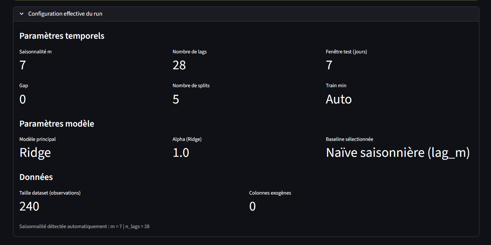

# README.md - Vitrine du projet “Moteur Prédictif PME”

<p align="left"> 
 
 
 


</p>


Ce dépôt présente un démonstrateur vitrine du moteur de prévision développé dans le cadre d’un MVP IA Prédictive pour PME.  
Il a été conçu pour :
- Illustrer une approche rigoureuse de la prévision de ventes/stocks
- Montrer une architecture professionnelle, claire et modulaire
- Démontrer ma capacité à produire un pipeline stable, reproductible et interprétable
- Sans exposer le code source complet du moteur (propriété intellectuelle)

Ce repo est une vitrine, pas un dépôt technique : seuls des extraits simplifiés, schémas, éléments conceptuels et explications sont fournis.

---

# Table des matières

1. [Introduction : moteur de prévision pour PME](#1-introduction--moteur-de-prévision-pour-PME)
2. [Architecture conceptuelle du pipeline](#2-architecture-conceptuelle-du-pipeline)
3. [Fonctionnalités clés](#3-Fonctionnalités-clés)
4. [Schémas complémentaires](#4-schémas-complémentaires)
5. [Extraits de code (snippets illustratifs)](#5-extraits-de-code-snippets-illustratifs)
6. [Aperçu de l’interface Streamlit (UI)](#6-aperçu-de-linterface-Streamlit-UI)
7. [Résultats & comportements observés](#7-résultats--comportements-observés)
8. [Documentation (dossier /docs)](#8-documentation-dossier-docs)
9. [Stack technique (MVP)](#9-stack-technique-MVP)
10. [Prochaines étapes : Phase 2 (industrialisation)](#10-Prochaines-étapes--Phase-2-industrialisation)
11. [Pour aller plus loin](#11-pour-aller-plus-loin)
12. [Licence](#12-licence)
<br></br>
---

# 1. Introduction : moteur de prévision pour PME

## Contexte

Les PME travaillent massivement sous Excel, avec peu de solutions prédictives simples et accessibles.  
Ce projet vise à combler ce manque.

## Objectifs du MVP

### Objectifs fonctionnels

- Fournir une prévision fiable pour les contextes PME (ventes, production, énergie, stocks)
- Faciliter l’utilisation via une interface simple (Streamlit)
- Générer des artefacts standardisés documentant chaque run
- Donner une lecture métier facile à interpréter

### Objectifs techniques

- Garantir la reproductibilité (walk-forward, hashing dataset)
- Centraliser la logique (séparation lib / interface)
- Assurer une traçabilité complète (métriques, paramètres, durée, versions)
- Préparer les fondations d’une future API Phase 2

## Pourquoi un moteur maison ? 

Pourquoi un moteur maison et non Prophet / Darts / Kats / AutoTS / Orbit ?

Le MVP Phase 1 a été conçu comme un pipeline pédagogique et maîtrisable de bout en bout (ingestion → features → validation walk-forward → export d’artefacts).

Le choix a donc été de ne pas utiliser de frameworks externes comme Prophet, Darts, Kats, AutoTS ou Orbit. Ces librairies sont puissantes mais leur incorporation dès la phase 1 aurait été prématurée pour un pipeline nécessitant traçabilité, contrôle strict des invariants temporels (no-leakage) et une montée en compétence nécessitant une compréhension fine de chaque étape.

Pour cette phase 1 j'ai donc privilégié :
- Un moteur simple et transparent
- Un modèle de référence robuste (Ridge ou RandomForestRegressor + baselines)
- Une architecture modulaire
- Des artefacts reproductibles

La Phase 2 intégrera progressivement ces modèles avancés (Prophet, RandomForest, XGBoost, éventuellement Darts/Orbit)
comme plugins optionnels dans la couche AutoML-lite.

## Ce repo vitrine

Ce dépôt est une vitrine conceptuelle. Il ne contient aucun code de production mais a pour but d'illustrer :
- L'architecture du moteur
- Les principes méthodologiques
- Des extraits de code pédagogiques
- La démarche d'auto-formation

Il ne contient pas le code complet du moteur (propriété intellectuelle).
<br></br>

---

# 2. Pipeline détaillé (vue interne simplifiée)

Le pipeline de prévision suit une chaîne d’étapes contrôlées :

```
(1) [Données brutes]
      - vérification structurelle (dates, cible, cohérence)
      - harmonisation des colonnes temporelles
      ↓
(2) Préparation & features
      - validation du dataset
      - création de variables explicatives (lags, calendrier…)
      - intégration éventuelle de signaux externes
      - constitution d’un dataset supervisé
      ↓
(3) Sélection du modèle (AutoML-lite)
      - préparation d’un espace de modèles simples et robustes
      - validation temporelle pour évaluer stabilité et cohérence
      - choix automatique du candidat le plus fiable
      ↓
(4) Walk-forward
      - découpages chronologiques successifs
      - entraînement + prédiction sur chaque segment
      - métriques globales et par période
      ↓
(5) Export artefacts
      - tableaux de synthèse (CSV)
      - visualisations (PNG)
      - contexte d’exécution
      - modèle exporté + fiche modèle (model card)
      ↓
(6) Inférence batch
      - reproduction cohérente du traitement appliqué en entraînement
      - génération d’un fichier predictions.csv
      ↓
(7) Interface UI
      - visualisation des résultats
      - mode démo et mode laboratoire
      - exécution sur CSV uploadés
```

---

# 3. Fonctionnalités clés

- Walk-forward rigoureux : validation temporelle multi-splits pour mesurer la stabilité du modèle
- AutoML-lite : sélection automatique du meilleur modèle parmi plusieurs candidats
- Génération d’artefacts structurés et export normalisé :
  - Métriques globales/détaillées
  - Configuration du run
  - “model card” (métadonnées)
  - Visualisations
- Interface métier (Streamlit) pour permettre à un utilisateur non technique de : 
  - Charger un fichier CSV
  - Lancer une évaluation
  - Visualiser les prédictions et métriques
- Traçabilité: chaque run est documenté (config, durée, environnement)
- Mode démonstrateur : un script end-to-end permet de générer un run complet et ses artefacts
<br></br>
---

# 4. Schémas complémentaires

## Principe du walkforward

```
Timeline (dates croissantes)  --->

train_1          test_1
|-----------------|----|
t0                t1   t2

        train_2           test_2
        |------------------|----|
        t1                 t3   t4

                train_3           test_3
                |------------------|----|
                t2                 t5   t6
```

Principe :
- Chaque fenêtre d'entraînement (train_k) utilise uniquement le passé
- Chaque fenêtre de test (test_k) vient immédiatement après ou avec un "gap"
- Les métriques sont calculées sur chaque test_k
- Un agrégat global (ex. MAE moyen) mesure les performances
- La variance inter-splits renseigne sur la stabilité temporelle

## Structure des artifacts

```
artifacts/
└── <run_id>/                          # un dossier par exécution du pipeline
    ├── summary.csv                    # métriques globales (agrégées)
    ├── details.csv                    # métriques par split / horizon
    ├── predictions.csv                # prédictions alignées sur la série
    ├── model_card.json                # description structurée du modèle
    ├── run_info.json                  # métadonnées du run (config, durée...)
    └── figures/                       # visuels de restitution
        ├── forecast_last_split.png
        ├── errors_by_split.png
        └── comparaison_baseline.png
```

Remarques :
- <run_id> peut être un timestamp ou un identifiant lisible (ex: "2024-11-20_1430").
- La structure met l'accent sur la traçabilité et la reproductibilité.
- Le contenu exact reste propre au moteur sous-jacent (non exposé ici).
<br></br>
---

# 5. Extraits de code illustratifs

Les snippets suivants démontrent le style, la clarté et les principes du projet réel, sans en révéler la logique interne.

Ce sont des versions simplifiées. Le moteur réel inclut également :

- Validation de schémas (Pandera)
- Logging structuré
- Gestion fine des fréquences (D, W, M)
- Intégration d’exogènes
- Rolling windows avancés
- Tests unitaires
- Docstrings complètes

## 5.1 Création de lags (simplifié)

Ce snippet illustre la transformation d’une série temporelle en dataset supervisé avec des lags simples.

```python
def make_supervised_example(df, target_col: str, n_lags: int = 3):
    """
    Exemple simplifié : construction de quelques lags pour illustrer le principe.
    Cette fonction est une version *démonstrative* utilisée dans le repo vitrine.
    """
    out = pd.DataFrame(index=df.index)

    y = df[target_col].astype(float)

    # Lags simples de la cible (principe)
    for i in range(1, n_lags + 1):
        out[f"lag_{i}"] = y.shift(i)

    # On garde aussi la cible pour entraînement
    out["target"] = y

    return out.dropna()
```

Différences avec le code réel :
- Gère plusieurs fréquences temporelles (D, W, M)
- Inclut des features rolling causales (mean, std, min, max…)
- Intègre des exogènes (météo, calendrier, événements)
- Valide strictement le schéma d’entrée (index temps, colonnes, types)
- Gère les cas limites (série courte, NA, trous dans les dates)

## 5.2 Mini-factory de modèle

Ce snippet montre une fabrique minimale pour instancier un modèle Ridge.

```python
from sklearn.linear_model import Ridge

class RidgePredictor:
    """
    Exemple de wrapper simplifié autour de sklearn.linear_model.Ridge.
    Le projet réel utilise une version enrichie (log, validation, etc.).
    """

    def __init__(self, alpha: float = 1.0):
        self.model = Ridge(alpha=alpha)

    def fit(self, X, y):
        self.model.fit(X, y)
        return self

    def predict(self, X):
        return self.model.predict(X)
```

Différences avec le code réel :
- Supporte plusieurs familles de modèles (linéaires, arbres, etc.)
- Gère des espaces d’hyperparamètres plus complets
- Centralise les valeurs par défaut “sûres” pour les contextes PME
- Inclut une gestion de seed / random_state cohérente entre modèles
- Est intégré à une logique AutoML-lite (scoring, sélection, traçabilité)

## 5.3 Entrée CLI (Typer)

Ce snippet illustre un point d’entrée Typer minimal pour lancer une prédiction batch depuis un fichier CSV.

```python
@app.command("predict")
def cmd_predict(
    config: Path = typer.Option(..., "--config"),
    input_csv: Path = typer.Option(..., "--input-csv"),
    output_csv: Path = typer.Option(..., "--output-csv"),
):
    """
    Exemple ultra-simplifié de commande CLI pour lancer une prédiction.
    La version réelle du projet gère :
    - Chargement de modèle exporté
    - Reconstruction des features d'inférence
    - Alignement des features avec la signature du modèle
    - Gestion des erreurs (historique insuffisant, colonnes manquantes, etc.)
    """
    # 1) Charger la config
    # 2) Charger le modèle
    # 3) Lire le CSV brut
    # 4) Construire les features pour l'inférence
    # 5) Appliquer model.predict(...)
    # 6) Sauvegarder predictions.csv
    ...
```

Différences avec le code réel :
- Validation des chemins et formats (CSV, encodage, séparateur)
- Gestion d’erreurs explicite (fichiers manquants, colonnes invalides…)
- Logging structuré (niveau INFO/ERROR, durée, contextes)
- Appels à une librairie interne d’inférence (et non à du code inline)
- Options de configuration supplémentaires (horizon, modèle, artefacts…)

## 5.4 Structure d'une model card

Ce snippet montre une structure JSON minimale décrivant un modèle exporté.

```json
{
  "model_type": "ridge",
  "hyperparameters": {
    "alpha": 1.0
  },
  "features": [
    "lag_1",
    "lag_7",
    "lag_28",
    "roll_mean_7",
    "is_weekend",
    "temp_celsius",
    "... etc ..."
  ],
  "feature_signature": {
    "feature_names_in": ["lag_1", "lag_7", "temp_celsius", "..."],
    "required_max_lag": 28,
    "n_features": 40
  },
  "task": {
    "type": "time_series_forecast",
    "horizon": 7,
    "gap": 0
  },
  "dataset": {
    "target_col": "quantity",
    "date_col": "date",
    "freq": "D"
  },
  "metrics": {
    "mase": 0.67,
    "mae": 30.1
  },
  "created_at": "2025-01-15T10:30:00Z"
}
```

Différences avec le code réel :
- Ajoute des métadonnées complètes (hash dataset, version libs, durée run)
- Documente le protocole de validation (type de split, n_splits, horizon)
- Indique la fréquence temporelle et les exogènes utilisées
- Contient un champ “limitations / notes métier”
- Est générée automatiquement à chaque run (pas écrite à la main)
<br></br>
---

# 6. Aperçu de l’interface Streamlit (UI)

Voici un aperçu visuel (données fictives) de la page principale de démonstration utilisée pour présenter les résultats du moteur dans un contexte métier. Cette capture illustre uniquement l’onglet “Résumé du run”. 

L’interface complète du tableau de bord comporte plusieurs modules : 
- Chargement CSV et évaluation Walk-Forward
- Prédiction via artefact exporté
- Visualisation détaillée des artefacts (model_card, summary, details, predictions)
- Comparaison des runs (base_run vs exog_run)
- Graphiques d’erreurs et lecture qualitative 

Toutes ces vues reposent sur les artefacts générés automatiquement par le moteur interne.



---

# 7. Résultats & comportements observés

Sur un jeu de données test e-commerce (18 mois, fréquence journalière) :

| Modèle            | MASE | MAE  | RMSE | Commentaire                |
| ----------------- | ---- | ---- | ---- | -------------------------- |
| Baseline Lag-1    | 1.00 | 45.2 | 68.1 | Référence minimale         |
| Ridge AutoML-lite | 0.67 | 30.1 | 44.3 | Sélectionné (-33% MAE) |
| Random Forest     | 0.72 | 32.5 | 48.2 | Overfit léger              |

**Stabilité temporelle :**
- Variance inter-splits : ±4.8 MAE (16% du MAE moyen)
- Aucun split aberrant (tous < 1.5× MAE médian)

**Impact des exogènes :**
- Météo (temp, précip) : +8% MASE
- Calendrier (jours fériés) : +5% MASE
- Combinaison : +12% MASE

Ces métriques sont illustratives (données fictives). Le projet réel utilise des métriques validées sur plusieurs datasets clients.
<br></br>

---

# 8. Documentation (dossier /docs)

Ce repo inclut plusieurs documents pédagogiques :
- `faq_technique.md` : approches, questions typiques, validation temporelle
- `methodologie_autoformation.md` : méthodologie implémentée pour l'auto-formation et la construction du MVP
- `decisions_architecturales.md` : choix techniques clés (walk-forward, exogènes, modularité)
- `article_medium_link.md` : résumé et lien vers l’article Medium associé

Ces documents permettent de comprendre la démarche globale sans révéler l’IP du moteur réel.
<br></br>

---

# 9. Stack technique (MVP)

| Domaine            | Technologies / Outils |
|--------------------|------------------------|
| Langage            | Python |
| Manipulation data  | Pandas, NumPy |
| Modélisation ML    | scikit-learn (Ridge, RandomForestRegressor, baselines...) |
| Validation         | Walk-forward strict, Pandera |
| Configuration      | Pydantic Settings, YAML |
| Logging & Debug    | Loguru |
| CLI & Outils       | Typer |
| Interface          | Streamlit |
| Artefacts          | JSON / CSV / PNG (model_card, summary, details, predictions…) |
| CI/CD              | GitHub Actions |
<br>

---

# 10. Prochaines étapes : Phase 2 (industrialisation)

La Phase 2 visera à transformer ce moteur en une solution déployable en production :

- Prévision multi-horizon récursive (h = 1…7+ jours)
- API FastAPI pour intégration ERP
- Monitoring, dérive, alertes et réentraînement
- Gestion multi-séries et exogènes enrichies
- AutoML-lite étendu (XGBoost, LightGBM, ensembles)
- Interface Streamlit avancée (A/B tests, comparaison runs)
- Support des fréquences multiples (D/W/M)
<br></br>
---

# 11. Pour aller plus loin

- Article Medium : _“Construire un moteur de prévision robuste pour PME — Retour d’expérience”_  
    _(à insérer)_
- [LinkedIn](https://www.linkedin.com/in/gilles-richard-710409168/)

Pour toute question ou discussion, n’hésitez pas à me contacter
<br></br>

---

# 12. Licence

Ce dépôt est une vitrine conceptuelle. Aucun code de production n'est fourni ici.

Les éléments sont publiés sous des licences différentes selon leur nature :
- Code (snippets Python) : MIT License
- Documentation (README, `/docs/*.md`) : CC BY-SA 4.0
- Visuels (`/architecture/*.png`) : CC BY-SA 4.0

Pour plus de détails, consulter le fichier `LICENSE`.